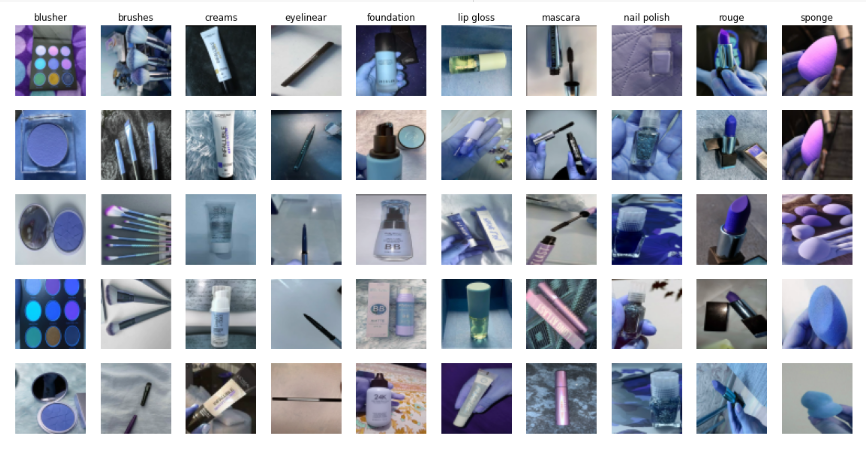
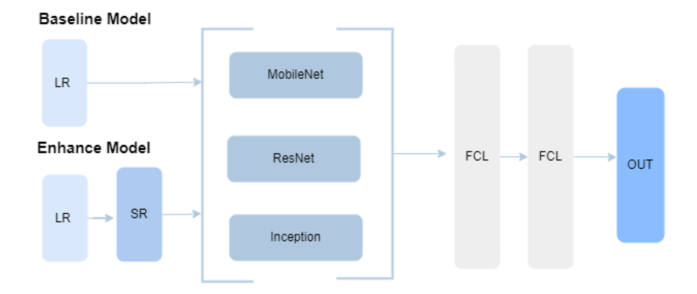
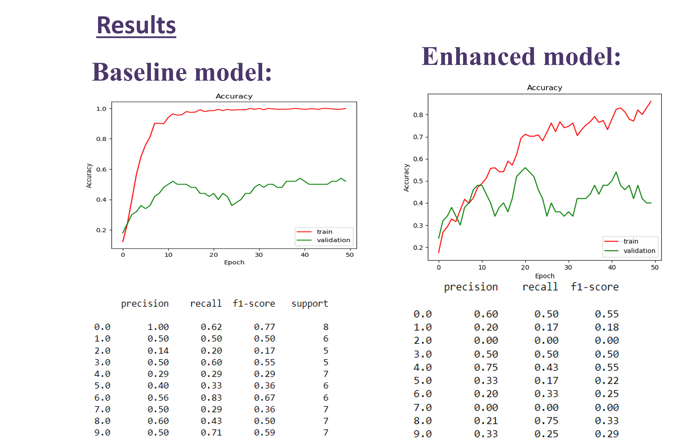

# Makeup Classification 

## Description:
Recently, most classification problems assumed that images have high resolution in order to extract features. In addition, most of the algorisms require large amounts of datasets to be able to learn. That’s where transfer learning was introduced to allow low resolution and less amount of dataset to be learned based on other learned models. It is basically a model trained on a huge high-resolution dataset having the needed model parameters in the last 2 or 3 layers to learn them in addition. Since we try to solve a makeup classification problem with a low number of instances (500) and 10 classes with low resolution (64*64), we aim to apply multiple methods including transfer learning to classify our objects.

,then splitting the dataset into 70% train , 10% validation,20% test.

# Baseline model:
The dataset was fed directly to the models after being resized, then the 3 FCL  with 50 epochs, Adam optimizer with LR=0.0001, and loss function: Sparse categorical entropy. Relu activation was used with the hidden layers and softmax for the last one. 

# Enhanced model:
An enhanced deep super-resolution network (EDSR)  technique was applied to enhance the 64*64*3 images. Then they were fed to the pre-trained models.
The hyperparameter tuning is done for each model separately. 

# Conclosion:
The best model for the baseline approach is the Mobil-Net with an accuracy of 45%, however, it suffers from overfitting. ResNet reached only 30%, inception net reached 0.38%. After applying SR, the accuracy reached 53%, which is not so high but still higher than the baseline. In addition, the inception model got the accuracy of 50%

